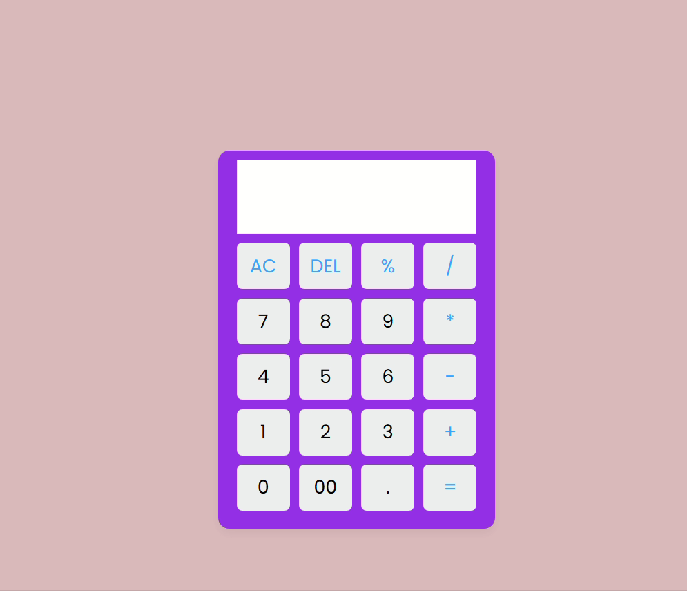

# 🔢 Interactive Web Calculator

A sleek and interactive calculator built with HTML, CSS, and JavaScript — now with full **keyboard support**, **calculation history**, and mobile-friendly design!

## 🚀 Live Demo

> Type using your **keyboard number pad** or click the buttons!

 

---

## 🧠 Features

✅ Responsive UI  
✅ Clickable buttons  
✅ Keyboard number pad input  
✅ Operator key support (`+`, `-`, `*`, `/`, `%`, `.`)  
✅ `Enter` to calculate, `DEL` to delete, `AC` or `Esc` to clear  
✅ Calculation history with click-to-reuse  
✅ Interactive button feedback on press

---

## ⚙️ Tech Stack

| Layer     | Technology    |
|-----------|----------------|
| Markup    | HTML5          |
| Styling   | CSS3 (Flexbox & Grid) |
| Logic     | JavaScript  |
| Fonts     | Google Fonts (Poppins) |

---

## 🧰 How to Run Locally

1. Clone the repository:

   `git clone https://github.com/sourav6102003/Calculator.git`
   ` cd calculator`
   `start index.html`   # Windows
   `open index.html`    # macOS
   `xdg-open index.html` # Linux
